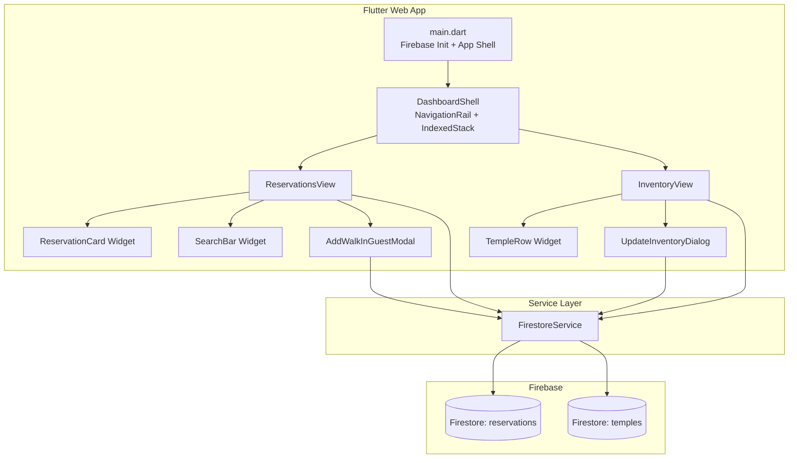
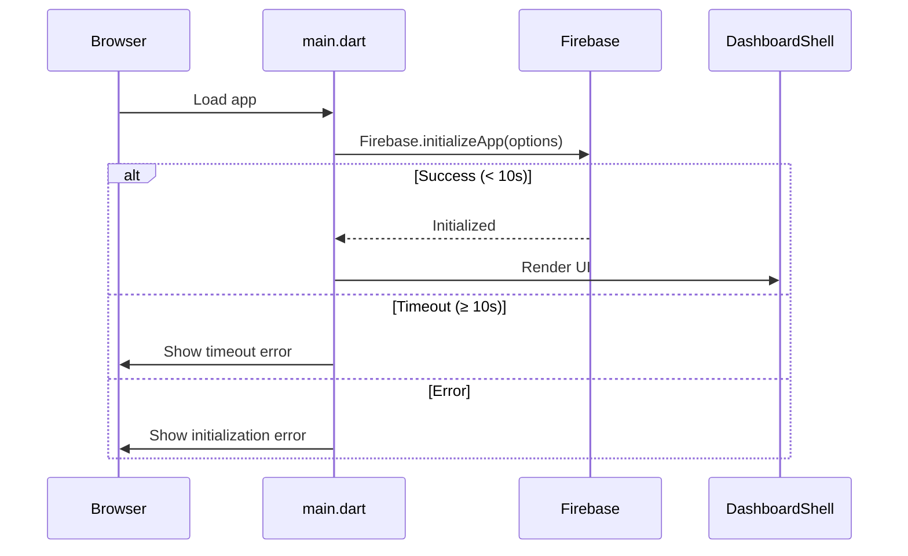

# Design Document: Property Management Dashboard

## Overview

The Property Management Dashboard is a Flutter Web prototype providing property managers with a centralized interface for managing reservations and property inventory (temples). The application connects to Firebase Firestore for persistent storage and uses real-time streams to reflect data changes without manual refreshes.

The system consists of two primary views—Reservations and Inventory—connected through a persistent NavigationRail with IndexedStack-based view preservation. A service layer abstracts all Firestore interactions, ensuring clean separation between UI and data access logic.

### Key Design Decisions

| Decision | Rationale |
|----------|-----------|
| Flutter Web (single-platform) | Prototype targeting browser deployment only; no native mobile builds required |
| Firebase Firestore | Real-time sync, serverless, minimal backend infrastructure for a prototype |
| NavigationRail + IndexedStack | Preserves view state across navigation without rebuilding widgets |
| Service layer abstraction | Enables testability and prevents Firestore coupling in UI code |
| Material 3 | Modern design language with built-in component theming |
| snake_case Firestore schema | Matches existing Firestore collection conventions; no field name transformation needed |

## Architecture



### Initialization Flow



### Data Flow Pattern

All views consume Firestore data through `Stream<List<Model>>` exposed by `FirestoreService`. The service layer maps Firestore document snapshots to typed Dart model instances. Views use `StreamBuilder` widgets to reactively render data.

```mermaid
flowchart LR
    Firestore -->|snapshots()| FirestoreService
    FirestoreService -->|Stream<List<T>>| StreamBuilder
    StreamBuilder -->|data| ViewWidget
```

## Components and Interfaces

### 1. Entry Point (`lib/main.dart`)

Responsible for Firebase initialization with timeout handling and bootstrapping the app.

```dart
Future<void> main() async {
  WidgetsFlutterBinding.ensureInitialized();
  
  try {
    await Firebase.initializeApp(
      options: const FirebaseOptions(
        apiKey: '...',
        authDomain: '...',
        projectId: '...',
        storageBucket: '...',
        messagingSenderId: '...',
        appId: '...',
      ),
    ).timeout(const Duration(seconds: 10));
    
    runApp(const DashboardApp());
  } on TimeoutException {
    runApp(const ErrorApp(message: 'Firebase initialization timed out'));
  } catch (e) {
    runApp(ErrorApp(message: 'Firebase initialization failed: ${e.runtimeType}'));
  }
}
```

### 2. FirestoreService (`lib/services/firestore_service.dart`)

Single service class encapsulating all Firestore operations.

**Interface:**

```dart
class FirestoreService {
  // Reservations
  Stream<List<Reservation>> getReservationsStream();
  Future<void> addReservation(Reservation reservation);
  
  // Temples (Inventory)
  Stream<List<Temple>> getTemplesStream();
  Future<void> updateTemple(String documentId, {required int totalCapacity, required int availableRooms});
}
```

**Design Notes:**
- Returns `Stream<List<T>>` for real-time reactive data
- Methods throw `FirestoreServiceException` on failures (wrapping platform exceptions)
- Preserves snake_case field names; no camelCase conversion
- Ordering: reservations ordered by `created_at` descending; temples ordered by `temple_name` ascending

### 3. DashboardShell (`lib/views/dashboard_shell.dart`)

The root scaffold managing navigation and view state.

**Structure:**
- `NavigationRail` on the left with two destinations: Reservations and Inventory
- `IndexedStack` as the body containing both views simultaneously
- Only the selected view is visible; the other retains state in memory

### 4. ReservationsView (`lib/views/reservations_view.dart`)

Displays reservations with search/filter and add walk-in action.

**State:**
- `searchQuery`: current filter text (local state)
- `reservations`: streamed from `FirestoreService`

**Filtering Logic:**
- Performed client-side on the full list from the stream
- Case-insensitive substring match on `customer_name` OR `customer_phone`
- Triggered on each keystroke (no debounce for prototype simplicity)

### 5. InventoryView (`lib/views/inventory_view.dart`)

Displays temples with capacity information in a tabular layout.

**Calculated Field:**
- `bookedRooms = max(0, totalCapacity - availableRooms)`

### 6. UpdateInventoryDialog (`lib/widgets/update_inventory_dialog.dart`)

Modal dialog for editing temple capacity values.

**Validation Rules:**
- `total_capacity`: integer, 1 ≤ value ≤ 10,000
- `available_rooms`: integer, 1 ≤ value ≤ 10,000
- Constraint: `available_rooms` ≤ `total_capacity`
- Inline error messages displayed per field

### 7. AddWalkInGuestModal (`lib/widgets/add_walk_in_guest_modal.dart`)

Modal form for creating walk-in reservations.

**Validation Rules:**
- `customer_name`: non-empty, max 100 characters
- `customer_phone`: non-empty, max 20 characters, regex: `^\+?[\d\s\-]+$`
- Inline error messages displayed per field

**On Success:** Close modal; stream automatically updates ReservationsView.

## Data Models

### Temple (`lib/models/temple.dart`)

```dart
class Temple {
  final String id;
  final String templeName;
  final int totalCapacity;
  final int availableRooms;

  const Temple({
    required this.id,
    required this.templeName,
    required this.totalCapacity,
    required this.availableRooms,
  });

  int get bookedRooms => (totalCapacity - availableRooms).clamp(0, totalCapacity);

  factory Temple.fromMap(String id, Map<String, dynamic> map) {
    return Temple(
      id: id,
      templeName: map['temple_name'] as String,
      totalCapacity: map['total_capacity'] as int,
      availableRooms: map['available_rooms'] as int,
    );
  }

  Map<String, dynamic> toMap() {
    return {
      'temple_name': templeName,
      'total_capacity': totalCapacity,
      'available_rooms': availableRooms,
    };
  }
}
```

### Reservation (`lib/models/reservation.dart`)

```dart
class Reservation {
  final String id;
  final String customerName;
  final String customerPhone;
  final DateTime createdAt;

  const Reservation({
    required this.id,
    required this.customerName,
    required this.customerPhone,
    required this.createdAt,
  });

  factory Reservation.fromMap(String id, Map<String, dynamic> map) {
    return Reservation(
      id: id,
      customerName: map['customer_name'] as String,
      customerPhone: map['customer_phone'] as String,
      createdAt: (map['created_at'] as Timestamp).toDate(),
    );
  }

  Map<String, dynamic> toMap() {
    return {
      'customer_name': customerName,
      'customer_phone': customerPhone,
      'created_at': FieldValue.serverTimestamp(),
    };
  }
}
```

### Firestore Schema

| Collection | Field | Type | Notes |
|------------|-------|------|-------|
| `temples` | `temple_name` | string | Property display name |
| `temples` | `total_capacity` | number (int) | Total rooms in property |
| `temples` | `available_rooms` | number (int) | Currently available rooms |
| `reservations` | `customer_name` | string | Guest name |
| `reservations` | `customer_phone` | string | Guest phone number |
| `reservations` | `created_at` | timestamp | Server-generated creation time |


## Correctness Properties

*A property is a characteristic or behavior that should hold true across all valid executions of a system—essentially, a formal statement about what the system should do. Properties serve as the bridge between human-readable specifications and machine-verifiable correctness guarantees.*

### Property 1: Search filter includes only matching results

*For any* list of reservations and any non-empty search query string, the filtered result shall contain exactly those reservations where `customer_name` or `customer_phone` contains the query as a case-insensitive substring — no matching reservation is excluded, and no non-matching reservation is included.

**Validates: Requirements 3.2, 3.3, 3.4**

### Property 2: Booked rooms calculation is non-negative and correct

*For any* Temple with `total_capacity` ≥ 0 and `available_rooms` ≥ 0, the computed `bookedRooms` value shall equal `max(0, total_capacity - available_rooms)` and shall never be negative.

**Validates: Requirements 4.3**

### Property 3: Inventory update validation is sound and complete

*For any* pair of integer inputs (`totalCapacity`, `availableRooms`), the inventory validation shall accept the input if and only if both values are integers in the range [1, 10000] and `availableRooms` ≤ `totalCapacity`. All other inputs shall be rejected with an appropriate error message.

**Validates: Requirements 5.2, 5.3**

### Property 4: Walk-in guest validation is sound and complete

*For any* pair of strings (`customerName`, `customerPhone`), the walk-in guest validation shall accept the input if and only if `customerName` is non-empty (after trimming) with length ≤ 100, and `customerPhone` is non-empty with length ≤ 20 and matches the pattern `^\+?[\d\s\-]+$`. All other inputs shall be rejected with inline error messages indicating which field is invalid.

**Validates: Requirements 6.2, 6.3**

### Property 5: Model serialization round-trip preserves data

*For any* valid `Temple` instance, calling `Temple.fromMap(id, temple.toMap())` shall produce a Temple equal to the original. *For any* valid `Reservation` instance (with a fixed timestamp for testing), calling `Reservation.fromMap(id, reservation.toMap())` shall produce a Reservation with identical `customerName` and `customerPhone` values. All keys in `toMap()` output shall be snake_case strings.

**Validates: Requirements 7.2**

## Error Handling

### Strategy

Error handling follows a layered approach:

| Layer | Responsibility | Pattern |
|-------|---------------|---------|
| Firebase Init | Catch `TimeoutException` and generic exceptions | Show `ErrorApp` widget instead of main UI |
| FirestoreService | Wrap Firestore exceptions in `FirestoreServiceException` | Throw typed exceptions with original error context |
| Views (StreamBuilder) | Handle `AsyncSnapshot.hasError` state | Show error message with retry callback |
| Dialogs/Modals | Handle service exceptions on submit | Show inline error, retain form data, keep dialog open |

### FirestoreServiceException

```dart
class FirestoreServiceException implements Exception {
  final String message;
  final Object? originalError;
  
  const FirestoreServiceException(this.message, {this.originalError});
  
  @override
  String toString() => 'FirestoreServiceException: $message';
}
```

### Error Recovery Patterns

1. **Stream errors (Views):** Display error banner with "Retry" button that resubscribes to the stream
2. **Write errors (Dialogs):** Display inline error message, preserve form state, allow re-submission
3. **Initialization errors:** Display full-screen error with error type description; no retry (requires page reload)

### Retry Mechanism

Views implement retry by resetting their stream subscription:

```dart
void _retry() {
  setState(() {
    _stream = _firestoreService.getReservationsStream();
  });
}
```

## Testing Strategy

### Unit Tests

Focus on specific examples, edge cases, and component behavior:

- **Model tests:** Verify `fromMap` handles missing/null fields gracefully, verify `toMap` output structure
- **Validation tests:** Boundary values (0, 1, 10000, 10001), empty strings, max-length strings
- **Widget tests:** Verify correct rendering of empty states, error states, loading states
- **Navigation tests:** Verify IndexedStack preserves state across tab switches

### Property-Based Tests

Using the `dart_check` (or `glados`) library for property-based testing in Dart.

**Configuration:**
- Minimum 100 iterations per property test
- Each test tagged with its design property reference

**Property Test Implementations:**

| Property | Generator Strategy |
|----------|-------------------|
| 1: Search filter | Generate lists of 0-50 Reservation objects with random names/phones; generate random query strings of length 0-20 |
| 2: Booked rooms | Generate random int pairs (0-100000) for capacity/available |
| 3: Inventory validation | Generate random integers (including negatives, zero, boundary values 1/10000/10001) and random non-integer strings |
| 4: Walk-in validation | Generate random strings including empty, whitespace-only, valid phone patterns, invalid characters, boundary lengths |
| 5: Serialization round-trip | Generate random Temple/Reservation instances with varied string content and integer values |

**Tag Format:**
```dart
// Feature: property-management-dashboard, Property 1: Search filter includes only matching results
```

### Integration Tests

- Firebase initialization with emulator
- Firestore stream subscription and real-time updates
- Full write-read cycle through FirestoreService

### Test Directory Structure

```
test/
├── models/
│   ├── temple_test.dart
│   └── reservation_test.dart
├── services/
│   └── firestore_service_test.dart
├── validation/
│   ├── inventory_validation_test.dart
│   └── walk_in_validation_test.dart
├── views/
│   ├── reservations_view_test.dart
│   └── inventory_view_test.dart
├── widgets/
│   ├── update_inventory_dialog_test.dart
│   └── add_walk_in_guest_modal_test.dart
└── properties/
    ├── search_filter_property_test.dart
    ├── booked_rooms_property_test.dart
    ├── inventory_validation_property_test.dart
    ├── walk_in_validation_property_test.dart
    └── model_serialization_property_test.dart
```
